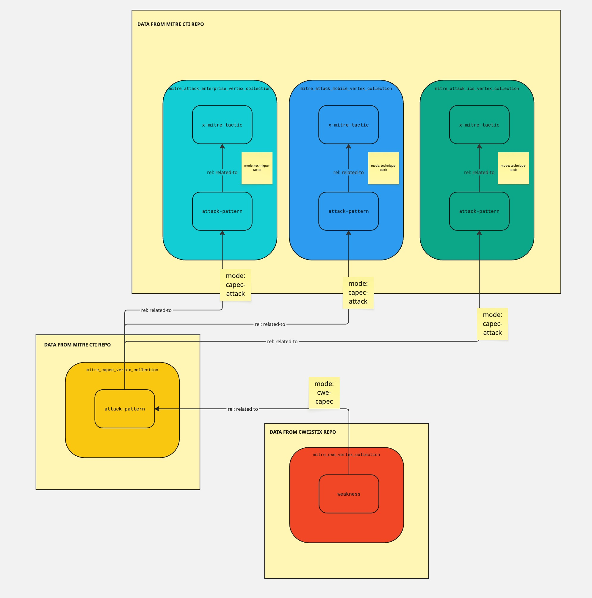

# Arango CTI Processor

[](https://codecov.io/gh/muchdogesec/arango_cti_processor)


A small script that creates relationships between common CTI knowledge-bases in STIX 2.1 format.

## Before you get started


Arango CTI Processor is built into [CTI Butler](https://www.ctibutler.com) which also handles the download of knowledgebase objects (what you need for ACTIP to work). As such, [CTI Butler](https://www.ctibutler.com) is probably better suited to what you're looking for.

## Overview

Here at DOGESEC we have many repositories that generate STIX objects for different knowledge-bases. Many of these knowledgebases often have some link to another.

For example, MITRE ATT&CK objects have references to MITRE CAPEC objects.

Arango CTI Processor is a script that;

1. reads the ingested CTI from the supported sources in ArangoDB
2. creates STIX Relationships and Grouping objects to represent the relationships between them

Arango CTI Processor is designed to work with the following data sources:

* MITRE ATT&CK
    * Enterprise
    * ICS
    * Mobile
* MITRE CWE
* MITRE CAPEC



[Source](https://miro.com/app/board/uXjVJ-ns2bI=/)

## Usage

### Install the script

```shell
# clone the latest code
git clone https://github.com/muchdogesec/arango_cti_processor
# create a venv
cd arango_cti_processor
python3 -m venv arango_cti_processor-venv
source arango_cti_processor-venv/bin/activate
# install requirements
pip3 install -r requirements.txt
````

### Configuration options

Arango CTI Processor has various settings that are defined in an `.env` file.

To create a template for the file:

```shell
cp .env.example .env
```

To see more information about how to set the variables, and what they do, read the `.env.markdown` file.

### Run

```shell
python3 arango_cti_processor.py \
    --database DATABASE \
    --relationship RELATIONSHIP \
    --ignore_embedded_relationships BOOLEAN \
    --stix2arango_note STRING \
    --modified_min DATETIME
```

Where;

* `--database` (required): the arangoDB database name where the objects you want to link are found. It must contain the collections required for the `--relationship` option(s) selected (see `.env.markdown` for more)
* `--relationship` (optional, dictionary): you can apply updates to certain relationships at run time. Default is all. Note, you should ensure your `database` contains all the required seeded data. User can select from;
    * `capec-attack`
    * `cwe-capec`
* `--ignore_embedded_relationships` (optional, boolean). Default is false. if `true` passed, this will stop any embedded relationships from being generated. This is a stix2arango feature where STIX SROs will also be created for `_ref` and `_refs` properties inside each object (e.g. if `_ref` property = `identity--1234` and SRO between the object with the `_ref` property and `identity--1234` will be created). See stix2arango docs for more detail if required, essentially this a wrapper for the same `--ignore_embedded_relationships` setting implemented by stix2arango
* `--modified_min` (optional, date). By default arango_cti_processor will consider all objects in the database specified with the property `_is_latest==true` (that is; the latest version of the object). Using this flag with a modified time value will further filter the results processed by arango_cti_processor to STIX objects with a `modified` time >= to the value specified.
* `--created_min` (optional, date). Same as `modified_min` but considers `created` date.

On each run, only the `_is_latest==true` version of objects will be considered by the script.

### Examples

```shell
python3 arango_cti_processor.py \
  --database arango_cti_processor_standard_tests_database \
  --relationship capec-attack \
  --ignore_embedded_relationships false 
```

## How it works

If you would like to know how the logic of this script works in detail, please consult the `/docs` directory.

## Useful supporting tools

* To generate STIX 2.1 extensions: [stix2 Python Lib](https://stix2.readthedocs.io/en/latest/)
* STIX 2.1 specifications for objects: [STIX 2.1 docs](https://docs.oasis-open.org/cti/stix/v2.1/stix-v2.1.html)
* [ArangoDB docs](https://www.arangodb.com/docs/stable/)

## Support

[Minimal support provided via the DOGESEC community](https://community.dogesec.com/).

## License

[Apache 2.0](/LICENSE).